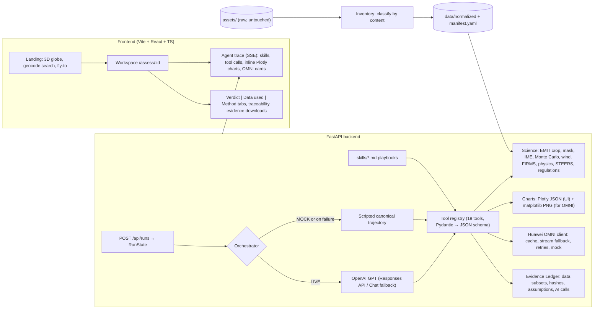

# Save the North: Satellite Emissions Verification Agent

A web app for environmental regulators. Search an industrial facility and click **Assess**, and an AI agent investigates it.
The agent discovers the cached data, loads skill playbooks and calls deterministic science tools. It uses Huawei OMNI to
read charts, satellite images and permit documents, then returns a **screening estimate of the methane emission rate
with uncertainty**, a likely cause, annualized scenarios and a regulatory screening verdict. Every number traces back to
the exact data, pixels and assumptions it came from.

> **Single-case prototype.** The app looks general, but only one case has data: the **ETC Lenorah / Red Lake gas
> processing site near Stanton, Martin County, Texas**, and the methane plume NASA EMIT observed on **2025-08-08
> ~14:45 UTC**. Other facilities conclude "no cached observations — cannot assess".
> **All results are satellite-based screening estimates, not enforcement determinations.**

**Result for the case** (Demo mode, real data): **BUSTED** — ~**23 t/h** CH₄ (p5–p95 15–29 t/h), ~230× the EPA 100 kg/h super-emitter
threshold, with no matching TCEQ emissions-event report in the records provided. Flare slip from a lit flare is physically
implausible at this rate, so the likely cause is an uncombusted flare/relief-system release (medium confidence).

## Quick start

```bash
make setup     # or: python tasks.py setup    (venv + pip, npm install, globe textures, .env)
make prep      # or: python tasks.py prep     (inventory assets/ -> data/manifest.yaml, ASSET_REPORT.md, precompute charts)
make dev       # or: python tasks.py dev      (FastAPI :8000 + Vite :5173) -> open http://localhost:5173
make test      # or: python tasks.py test     (45 tests)
make demo      # or: python tasks.py demo     (DEMO_REPLAY=1: replays the last recorded run, fully offline)
```

`make` is optional. `tasks.py` is a cross-platform runner, and the Makefile just calls it. The app runs end to end
**without API keys**: the scripted agent and mock OMNI switch on automatically. Requires Python 3.11 and Node 18+.

## Demo vs Live, and where the API keys go

The app has a small **Demo | Live** toggle (top right). **Demo** runs a scripted agent through the same real tools and
data, with no API calls. It works with no keys. **Live** runs the OpenAI GPT orchestrator and real Huawei OMNI calls. The
toggle is disabled until keys are configured.

To enable Live, put your keys in **`.env` in the project root** (`SkyFall/.env`, created from `.env.example` by
`setup`; it is git-ignored):

```ini
OPENAI_API_KEY=sk-...
OPENAI_MODEL=gpt-...                         # the model your key can use
OMNI_API_KEY=...                             # Huawei OMNI (Qwen3.5-Omni) sponsor key
OMNI_BASE_URL=https://.../v1                 # OpenAI-compatible base URL that comes with the key
OMNI_MODEL=qwen3.5-omni-flash
```

Then **restart the backend**. Keys are read at startup, and there is no hot reload in OneDrive folders. `GET /api/health`
reports `live_available: true` when GPT is configured. If only the OMNI keys are missing, Live still runs GPT and uses
demo text for image and chart reading.

## Screens
- **Landing:** the logo fades in → brief data-collection bullets → search bar → globe (the search is never overlaid on the globe).
- **While the agent works:** a white card lists each step in plain language (e.g. "Mapping the methane plume · NASA
  EMIT"). Model responses are not shown.
- **Report:**
  1. A full-screen aerial image of the plant with a **BUSTED / ACCEPTED** stamp. The outcome is computed
     deterministically from the rule statuses. BUSTED means the release exceeds reporting thresholds and no matching
     TCEQ emissions-event report was found.
  2. Core figures: **allowed vs actual** emissions in t CO₂e/h, next to the **EMIT CH₄ enhancement** drawn over the site.
     "Allowed" is the EPA super-emitter threshold (100 kg CH₄/h), because the permit data provided contains no CO₂/CH₄
     limit (the MAERT was not ingested). CO₂e uses GWP100 = 29.8 (IPCC AR6, `verify: true`).
  3. Selected figures, then export, evidence, sources/method and agent-steps buttons.

## Environment variables (`.env`, see `.env.example`)

| Variable | Purpose |
|---|---|
| `OPENAI_API_KEY`, `OPENAI_MODEL` | GPT orchestrator (Responses API; falls back to Chat Completions). Both required for LIVE mode. |
| `OMNI_API_KEY`, `OMNI_BASE_URL`, `OMNI_MODEL` | Huawei OMNI (Qwen3.5-Omni) via its OpenAI-compatible endpoint. Default model `qwen3.5-omni-flash`. |
| `OMNI_FORCE_STREAM` | `auto` (try non-streaming, retry with `stream=True` on a stream error and remember), `true`, `false`. |
| `MOCK_LLM`, `MOCK_OMNI` | `auto` (on when the key is empty), `1`, `0`. These force Demo behaviour globally. |
| `DEMO_REPLAY` | `1` = replay the most recent successful run (LIVE recordings preferred) with realistic delays. |
| `MAX_AGENT_STEPS` | Orchestrator loop cap (default 30). |
| `FIRMS_MAP_KEY` | Only for `scripts/fetch_firms.py`. |

**Recording a demo:** add the keys, run one live assessment in the UI (recorded to `data/runs/<run_id>.jsonl`), then
`make demo`. OMNI answers are cached on disk (`data/cache/omni/`), so re-runs are deterministic and cost nothing.

## Architecture



**Principles:** code computes every number, and GPT only reasons over tool outputs. OMNI supplies qualitative
visual/document evidence and never numbers used in calculations. Missing data becomes a reported `data_gap`, never a
crash. The verdict is validated against run state: medians within 1%, regulatory statuses exactly equal, and every
`evidence_id` must exist in the ledger. Wrong numbers are rejected back to the model.

### Repository map
| Path | What |
|---|---|
| `backend/scripts/inventory.py` | Content-based asset classification → `data/manifest.yaml`, `ASSET_REPORT.md`, `data/normalized/` |
| `backend/science/` | EMIT loading/cropping, plume mask, IME + Monte Carlo, wind, FIRMS, STEERS, physics bounds, Carbon Mapper comparison/annualization, regulations |
| `backend/charts/` | 8 chart builders (`builders.py`), theme + export (`base.py`), browser-free PNG renderer (`static_png.py`) |
| `backend/tools/` | Tool registry + envelope, RunState + Evidence Ledger, science/OMNI/meta tools |
| `backend/agent/` | Orchestrator (live + scripted + fallbacks), verdict schema/validation |
| `backend/llm/omni.py` | Huawei OMNI client |
| `backend/config/case.yaml` | Every scientific constant, with unit, rationale and `verify` flag |
| `skills/` | 5 playbooks the agent loads (`data-discovery`, `methane-quantification`, `flare-and-cause-analysis`, `texas-regulatory-check`, `verdict-report`) |
| `frontend/src/` | Landing (globe), Workspace, components |

## Method (summary; the in-app **Method** tab shows the formulas with this run's values)
1. **Mask:** crop ±6 km around the plume source. Take a robust background (median/MAD) from a 2.5–4 km annulus with the plume
   excluded, threshold at μ + kσ (k ∈ {1.5, 2, 2.5, 3, 4}), apply a 3×3 opening, and keep components within 1 km of the source.
2. **IME** (Varon et al., 2018): ΔΩ = Δenh·10⁻⁶·n_air·M_CH₄; IME = ΣΔΩ·A_pix; U_eff = α ln U10 + β; Q = U_eff·IME/√A_mask.
3. **Monte Carlo** (N = 2000, fixed seed): U10, k, per-pixel noise (EMIT uncertainty layer), and α, β ± 20%.
4. **Physics:** plant CH₄ throughput ceiling (~300 t/h) vs the flared gas that flare slip would require (Q/(1−CE)).
5. **Regulations:** 40 CFR 60.5371a/b super-emitter threshold (p5/p95 logic); 30 TAC 101.201 RQ with ±1-day STEERS
   matching; physics check; NOx/MAERT and GHGRP marked NOT_ASSESSED.

**Deviations from the original spec (documented, not tuned):** the EMIT crop is **±6 km** (not ±4 km) because the plume
extends ~4.8 km downwind. The background annulus **excludes the dilated plume**, because the plume crosses it.

## Data sources and citations

| Data | Source / citation | Status in this build |
|---|---|---|
| EMIT L2B CH₄ enhancement, uncertainty, sensitivity v002 | Green, R. et al., NASA LP DAAC, doi:10.5067/EMIT/EMITL2BCH4ENH.002 | real (granule `20250808T144501_2522010_004`) |
| Carbon Mapper plume records | Carbon Mapper data portal, data.carbonmapper.org | **SYNTHETIC placeholder** (`data/synthetic/`); only the plume ID and the ~21.5 t/h figure come from the brief |
| FIRMS VIIRS active fire (NOAA-20, NOAA-21, Suomi-NPP) | NASA FIRMS, VIIRS 375 m active fire product | real, re-downloaded in 5-day chunks (`scripts/fetch_firms.py`) |
| Sentinel-2 L2A true colour / SWIR | Contains modified Copernicus Sentinel data 2026 (Copernicus Browser) | real but **low quality**: 2026-09-18 regional screenshots, approximate bounds |
| Hourly 10 m wind | Open-Meteo historical weather API (ERA5; Hersbach et al., 2020) | real (no T/P → defaults) |
| Statement of Basis, FOP O4734 | TCEQ | real |
| STEERS emissions-event reports | TCEQ Air Emission Event Report Database | real exports for incidents 441788, 452092 |
| Globe imagery | NASA Blue Marble / Black Marble (public domain, via three-globe) | downloaded by `setup`; country-outline fallback bundled |
| Site imagery (report hero, plume overlay) | Esri World Imagery (Esri, Maxar, Earthstar Geographics) | display only; `scripts/fetch_site_imagery.py`; attribution shown in the UI |
| Method | Varon, D. J. et al. (2018), *Atmos. Meas. Tech.* 11, 5673–5686 | — |
| Rules | 40 CFR 60.5371a/b; 30 TAC 101.201; 30 TAC 101.1(89) | — |

See `ASSET_REPORT.md` for how every file in `assets/` was classified, converted or ignored.

## Assumptions flagged `verify: true` (in `backend/config/case.yaml`)
- EMIT crop half-width 6 km (deviation from spec)
- Fallback pixel noise 15% (unused: uncertainty layer present)
- Default surface pressure 92,000 Pa and temperature 305 K (wind file has no T/P)
- Effective-wind model and coefficients: log form, α = 1.1, β = 0.6 (Varon 2018; EMIT-specific calibration should be confirmed); linear alternative a = 0.33, b = 0.45
- Plant inlet CH₄ fraction 0.75 (range 0.65–0.85)
- Flare combustion efficiency 0.98 (range 0.95–0.99)
- Detection-frequency scenarios {0.1, 0.5, 1.0} (used only when no non-detects exist)
- Texas reportable quantity 5,000 lb (natural-gas mixture, 30 TAC 101.1(89)(B)(iv) — confirm)
- Minimum event duration for the RQ test: 1 h

## Limitations
- One cached case. Satellite results are **screening estimates**, and one overpass cannot establish duration or annual totals.
- The Carbon Mapper cross-check is a **synthetic placeholder**, so it provides no corroboration until a real export is dropped into `assets/`.
- The Sentinel-2 images post-date the event and cannot resolve the plant. OMNI image analyses are context only.
- Wind comes from reanalysis ~5 km away, and it dominates the uncertainty.
- The mask uses connected components within 1 km. Detached downwind puffs are excluded, so IME is conservative.
- NO₂/NOx, permit MAERT and GHGRP data are not ingested, so those rules are NOT_ASSESSED.
- OMNI and GPT outputs depend on the configured models. Numbers never come from them.

## Notes for Windows
- kaleido 0.2.1 hangs on Windows, and Plotly ≥ 6 needs kaleido ≥ 1 plus Chrome. PNG snapshots for OMNI are therefore rendered by a
  matplotlib converter from the same figure JSON (`backend/charts/static_png.py`), so no browser is needed.
- `uvicorn --reload` file watching is unreliable inside OneDrive folders, so restart the backend after code changes.
